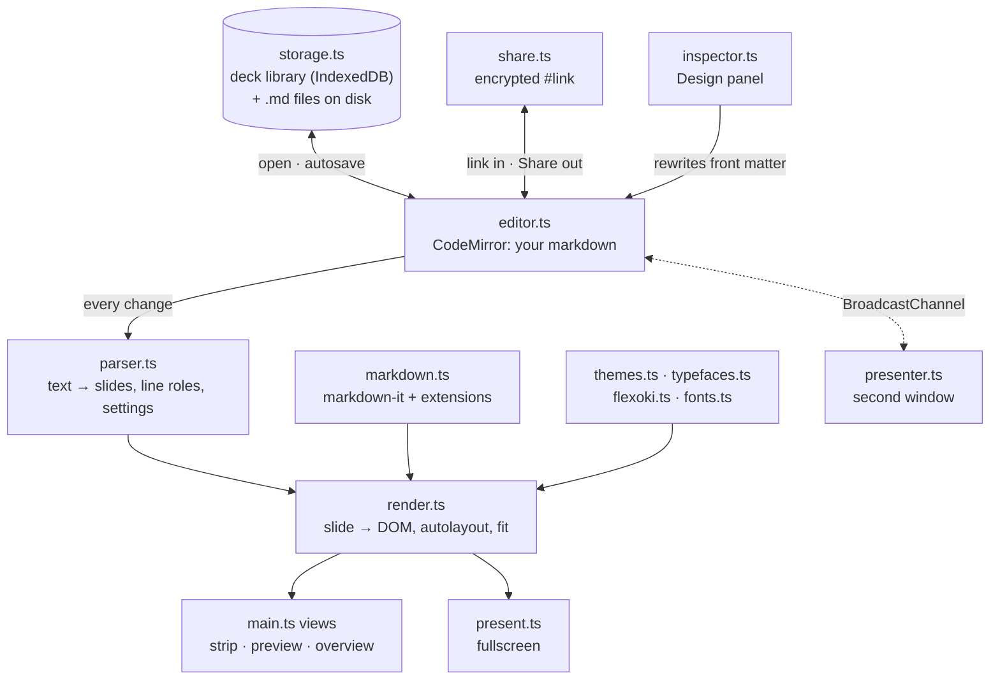
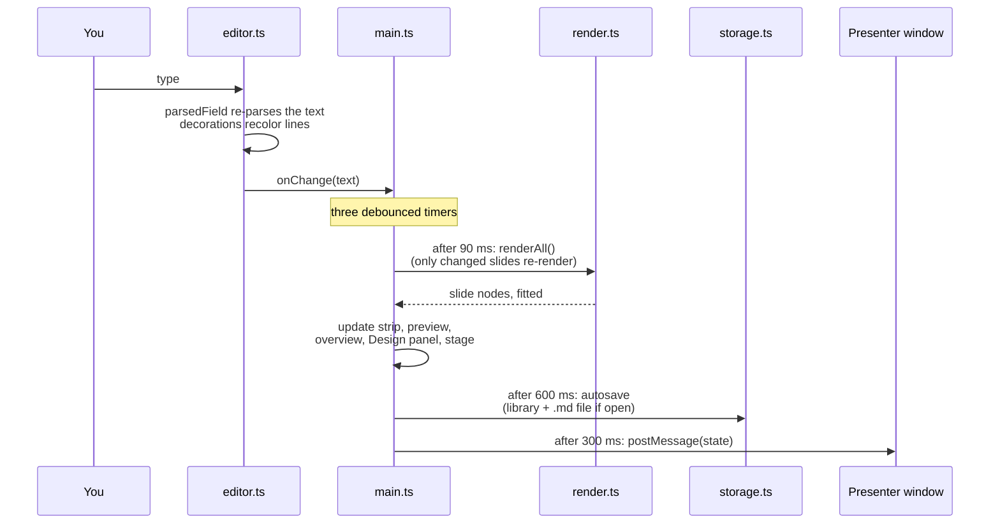
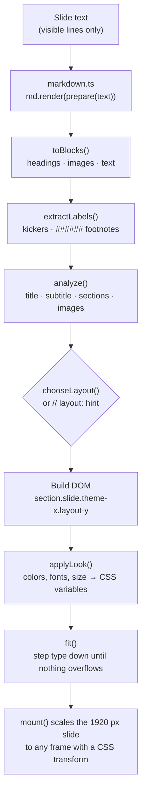
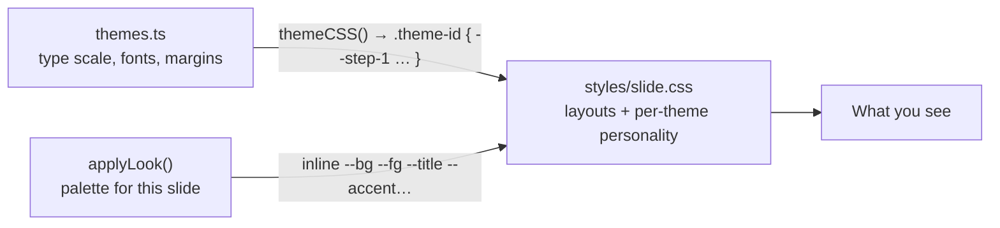
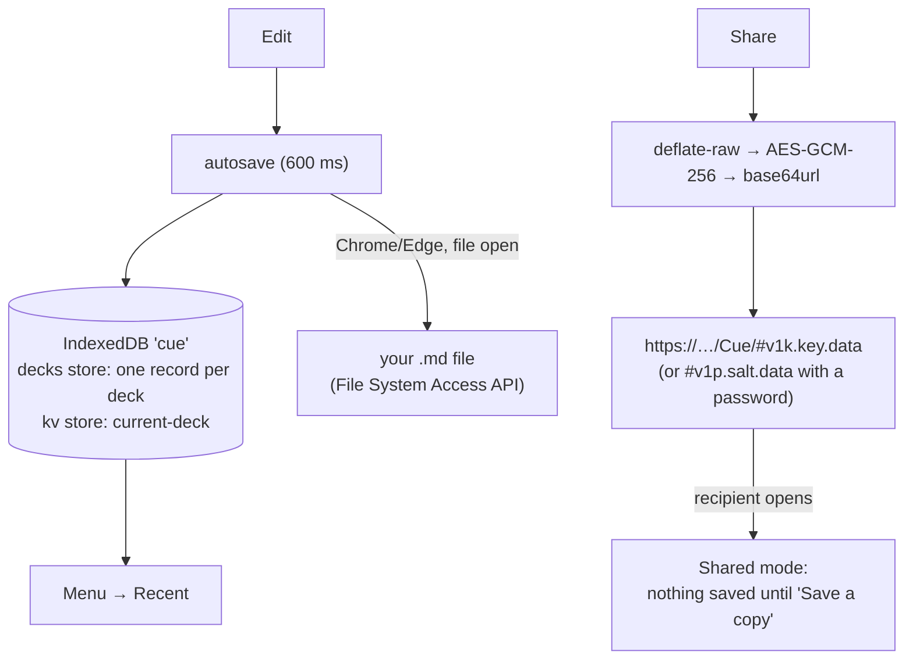
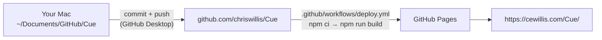

# How Cue works

Cue is a static web app: TypeScript and CSS, built by Vite, with no server. Everything happens in the browser. Your text is the single source of truth: slides, settings and layout are all derived from the markdown in the editor.

## The big picture

- **One page, two apps.** `index.html` loads `main.ts`. If the URL ends in `#presenter`, it boots the presenter window; otherwise it boots the editor.
- **Text in, slides out.** The editor holds the markdown. The parser splits it into slides and works out which lines are on the slide. The renderer turns each slide into DOM using a theme.
- **No stored state besides the text.** Theme, fonts, colors and aspect ratio live in the front matter at the top of the text. The Design panel edits that block, so undo, save and share include settings automatically.

## What happens on every keystroke

## From markdown to a slide

Every slide is laid out at a fixed logical size (1920 × 1080 for 16:9) and scaled down with a CSS transform wherever it appears. Type is designed once in pixels and looks the same in thumbnails, the preview, the presenter window and fullscreen.

### Layouts

`chooseLayout()` reads the shape of the content:

| Content | Layout |
| --- | --- |
| a `#` title alone | cover |
| a smaller heading alone | section |
| heading + text | content |
| one short tabbed paragraph | statement |
| a tabbed `>` quote | quote |
| text + image(s) | split |
| repeated subheadings | columns (or `// layout: timeline`) |
| several images | gallery |
| one image alone | full |

## How styling is layered

1. **Theme variables.** Each theme compiles to CSS custom properties on `.theme-<id>`: the type steps (`--step-0` … `--step-4`), fonts, margins, label style.
2. **Per-slide variables.** `applyLook()` writes colors, and any font or size overrides, inline on each slide. That's how patterns that change per slide, gradients and your Design panel overrides work.
3. **slide.css** uses only variables, so one set of layout rules serves every theme. Theme quirks are added as `.theme-nothing.layout-section …` rules near the bottom.

The editor chrome (toolbar, menu, panels) is styled separately in `styles/app.css`.

## Saving and sharing

- **Deck library** (`storage.ts`). Every deck is a record `{ id, name, text, createdAt, savedAt, handle? }`. `handle` is the file on disk when there is one. New decks are only saved after the first real edit.
- **Share links** (`share.ts`). The deck lives in the URL fragment (after `#`), which browsers never send to a server. Raw HTML in markdown is turned off, so a shared deck can't run code.

## Shipping it

`vite.config.ts` stamps the version (from `package.json`) and the commit into the build. They show at the bottom of the menu.

## The files

| File | What it does |
| --- | --- |
| `index.html` | The page, meta and Open Graph tags. Loads `src/main.ts`. |
| `src/main.ts` | App shell: boot, render loop, menu, views, saving, deck library, presenter sync. **Start here.** |
| `src/editor.ts` | CodeMirror setup, line roles, slide colors, badges, ⇥ marks, Tab/Enter keys. |
| `src/parser.ts` | Text → slides: which lines show, which are notes, front matter → settings. |
| `src/markdown.ts` | The markdown dialect (markdown-it + highlight, sup/sub, footnotes, math, tasks…). |
| `src/render.ts` | Slide DOM, autolayout, fit-to-slide, header/footer slots, scaling. |
| `src/themes.ts` | Every theme as data, compiled to CSS variables. |
| `src/typefaces.ts`, `src/fonts.ts` | Bundled fonts and their best weights. |
| `src/flexoki.ts` | The Flexoki palette, color patterns and swatches. |
| `src/badges.ts` | The editor's blue → gold slide colors. |
| `src/inspector.ts` | The Design panel. |
| `src/storage.ts` | IndexedDB deck library and real files. |
| `src/share.ts`, `src/share-ui.ts` | Encrypted share links and the Share dialog. |
| `src/present.ts` | Fullscreen Present mode. |
| `src/presenter.ts` | The presenter window (notes, next slide, timer). |
| `src/icons.ts` | Inline SVG icons. |
| `src/styles/slide.css` | How slides look: type, layouts, themes. |
| `src/styles/app.css` | How the app looks: toolbar, editor, panels, menu. |
| `src/sample.md` | The welcome deck. |

## Recipes

**Add a menu command.** Add `<button role="menuitem" data-act="my-thing">…</button>` to the menu in `shellHTML()` (`main.ts`). Then add `case 'my-thing':` to the click handler in the "events" section.

**Add a theme.** Copy a `define({...})` block in `themes.ts` and change its id, name, group, fonts and palettes. It shows up in the Design panel automatically. Extra styling goes in `slide.css` as `.theme-yourid …`.

**Add a font.** `npm install @fontsource-variable/<name>`, import its CSS in `fonts.ts`, and add an entry in `typefaces.ts`.

**Add a layout.** Add the name to `Layout` and `LAYOUTS` in `render.ts`, return it from `chooseLayout()` (or pick it with `// layout: name`), and style `.layout-name` in `slide.css`.

**Add a deck setting.** Add it to `Settings` and the defaults in `parser.ts`, read and write it in `toSettings()` and `serializeFrontMatter()`, use it in `render.ts`, and add a control in `inspector.ts`.

**Add markdown syntax.** Add a markdown-it plugin or rule in `markdown.ts`, and style its output in `slide.css`.

## Debugging

- Run `npm run dev` and open http://localhost:5173.
- In the browser console, `__cue` is a handle to the running app: `__cue.slides`, `__cue.parsed`, `__cue.goto(3)`, `__cue.updateSettings({ theme: 'nothing' })`.
- DevTools → Application → IndexedDB → `cue` shows the deck library.
- `npm run build` runs the TypeScript checker first. If it fails, the error says which file and line.
